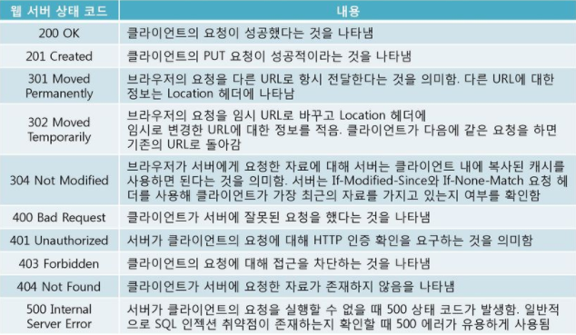

# 네트워크 서비스와 애플리케이션 계층
## 1. 애플리케이션 계층의 역할
* 사용자가 직접 체감할 수 있는 서비스를 제공
* 사용자가 직접 사용하는 프로토콜
    * HTTP: 웹 클라이언트와 웹 서버 사이에서 페이지 데이터를 주고받음
    * POP, SMTP, IMAP: 메일 송수신
    * SMB, AFP: LAN 안에서 파일 공유
    * FTP: 서버를 통해 파일 공유
    * Telnet, SSH: 원격에서 서버 제어
* 사용자가 간접적으로 사용하는 프로토콜  
사용자가 직접 사용하지 않고 OS나 다른 애플리케이션 계층의 프로토콜이 간접적으로 사용됨
    * DNS: 도메인명과 IP 어드레스의 정보를 서로 변환할 때 사용
    * SSL/TLS: 통신 데이터를 암호화하여 주요 정보를 안전하게 주고받을 때 사용
## 2. HTTP
### 웹 페이지가 표시되는 과정
1. 웹 브라우저가 웹 서버에 웹 페이지를 요청
1. 웹 서버가 HTML 형식으로 응답
1. 웹 브라우저가 HTML 해석하여 화면 그림  
이 때 HTML 형식 뿐만 아니라 화면을 띄우는데 필요한 각종 파일이 포함된다.(css, jpeg 등등)

### HTTP 메시지
웹 브라우저와 웹 서버는 HTTP 프로토콜을 사용한다. 이 때 주고받는 데이터를 HTTP 메시지라고 하며 요청 - 응답 형태로 구분된다. 
HTTP 메시지 구성
* 요청/응답 정보 행 - 메시지의 종류나 상태
* 헤더 - 메시지에 대한 상세 정보
* 빈 줄
* 메시지 바디 - 실제 보여지는 데이터 ex) html 응답  

### HTML은 상태가 없다  
 한번 통신하고 끊고 다음 통신때 다시 연결하는 방식

### HTTP 요청과 URL
HTTP 요청을 보내기 위해 URL 사용.  
***URL***  
ex) http :// www. domain.co.kr/ sample / index.html에서  
* http: 스키마 - 사용하는 프로토콜 
* www: 호스트 - 서버의 이름 혹은 역할 
* domain.co.kr: 도메인 - 서버를 운영하는 조직 
* sample: 디렉터리 - 서버 내의 디렉터리
* index.html: 파일 - 해당 디렉터리 내의 파일  

***HTTP 요청***    
* 행 - GET(POST 등등) 뒤에 디렉터리와 파일명, 프로토콜의 버전 정보
* 헤더 - host(웹서버 정보), 브라우저 정보
* 바디 - GET 요청의 경우 없음

### HTTP 응답과 상태 코드
***HTTP 응답***  
* 행 - 상태정보
* 헤더 - 파일 갱신 날짜, 파일 크기 등
* 바디 - HTML파일

### 상태코드 의미
