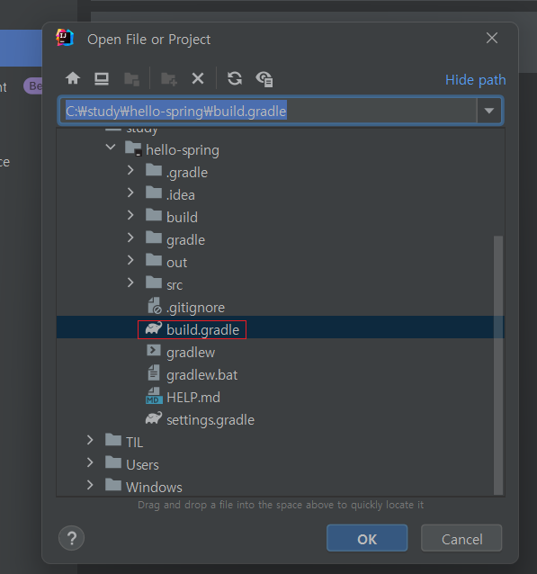

# 스프링부트 프로젝트 설정하기
사전 준비: 자바11, 인텔리제이
## 1. 스프링부트 스타터 사이트에서 프로젝트 생성
스타터 사이트: https://start.spring.io
* Project: Gradle Project
* Language: Java
* Spring Boot: 2.7.2 - 뒤에 영어 없는 거중에 가장 최신버전 선택
* Packaging: Jar
* Java: 11
* Dependencies: Spring Web, Thymeleaf  

Dependencies는 필요한 라이브러리 선택하는거. Thymeleaf는 html 템플릿 툴. 아직 뭔지 자세히 모른다. 
## 2. IntelliJ로 프로젝트 열기
위에처럼 세팅하고 GENERATE 누르면 압축파일 다운받는데, 압축 풀고 인텔리제이로 build.gradle 파일 열면 된다.

## 3. 자바로 실행 설정하기
IntelliJ는 Gradle을 통해 실행하는 것이 디폴트이다. 이러면 실행속도가 느려서 자바로 바로 실행하도록 설정 바꿔주는걸 추천한다. 
* File -> Settings -> Build, Execution, Deployment -> Build Tools -> Gradle
    * Build and run using: Gradle -> IntelliJ IDEA로 변경
    * Run tests using: Gradle -> IntelliJ IDEA로 변경

## 4. 실행해보기
* 메인메소드 실행
* localhost:8080으로 접속해 페이지 동작 확인 - 에러메시지 뜨면 성공.

## 참고
---
[스프링 입문 - 코드로 배우는 스프링 부트, 웹 MVC, DB 접근 기술 (김영한)](https://www.inflearn.com/course/%EC%8A%A4%ED%94%84%EB%A7%81-%EC%9E%85%EB%AC%B8-%EC%8A%A4%ED%94%84%EB%A7%81%EB%B6%80%ED%8A%B8)